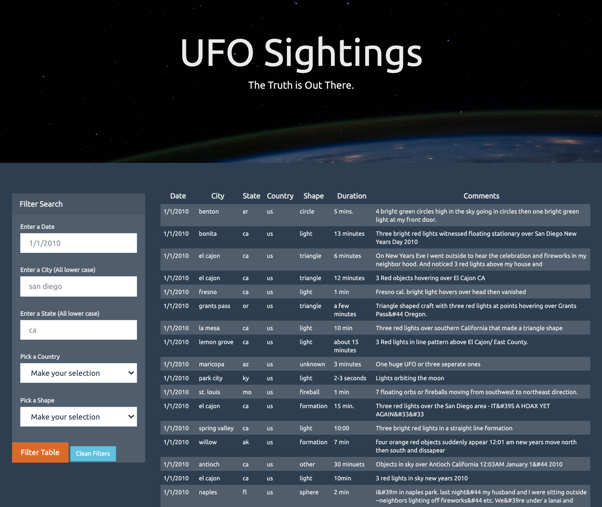

# JavaScript and DOM Manipulation

Penn Data Boot Camp Assignment 14 - Interactive webpage to display a dynamic table of UFO sightings data with filtering capabilities built on HTML Forms using JavaScript and D3.js

## Background

The objective of this assignment is to create an HTML page which dynamically displays a table based upon a provided UFO dataset. In addition to the dataset, a skeleton "index.html" and a "style.css" were also provided. The focus of this exercise was mainly JavaScript.

To achieve this, codes were written to append the table to HTML based on the dataset. Multiple filter options were then built by matching user inputs (text inputs and drop down selections) with the corresponding data. In addition, a "Clean Filters" option was also added to make the user experience seamless. The HTML and CSS codes were modified as needed throughout the process.
  

<strong>Below is a highlight of the webpage.</strong>
View the fully deployed Github Pages here: https://ztcnrh.github.io/JavaScript-and-DOM-Manipulation/
  

